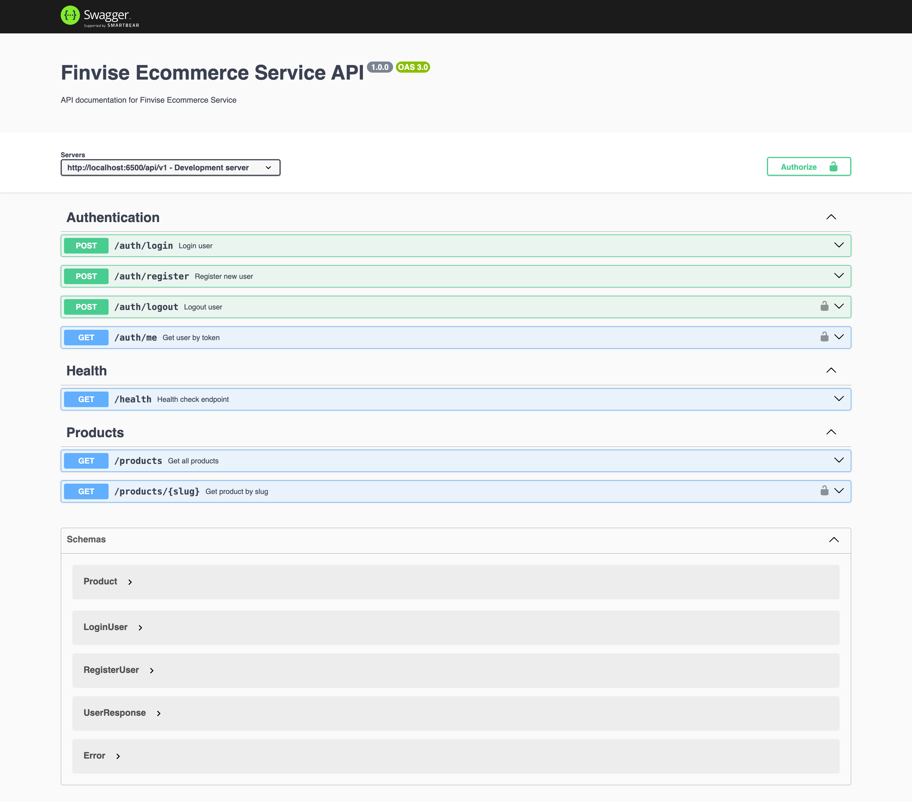

# Finvise Product Listing Service

This service handles product listings and authentication. It provides a RESTful API for listing products, user authentication, and detailed product information.

## Features

- Product listing with details (name, price, image, description)
- User authentication (login/register) with JWT
- Protected routes for detailed product information
- Health check endpoint
- Swagger documentation

## Swagger Screenshot



## Technology Stack

- TypeScript
- Node.js
- Express.js
- Drizzle ORM with SQLite database over Turso
- JWT for authentication
- Zod for validation
- Swagger for API documentation
- Vitest for testing

## Project Structure

```
ecommerce-service/
├── src/
│   ├── assets/           # Assets and static files
│   ├── config/           # Configuration files
│   ├── controllers/      # Route controllers
│   ├── db/               # Database configuration
│   ├── middlewares/      # Custom middleware
│   ├── models/           # Data models with Zod validation
│   ├── routes/           # API routes with Swagger documentation
│   ├── services/         # Business logic
│   ├── utils/            # Utility functions
│   └── app.ts            # Main application file
│   └── index.ts          # Entry point
├── tests/                # Unit and integration tests
│   └── integrations
│   └── services
│   └── utils
├── .dockerignore
├── .env.example
├── .eslintrc.js
├── .gitignore
├── Dockerfile
├── docker-compose.yml
├── drizzle.config.ts
├── package.json
├── package-lock.json
├── prettierrc.json
├── README.md
├── tsconfig.json
└── vitest.config.ts
```

## API Endpoints

- `GET /api/v1/health` - Health check endpoint
- `GET /api/v1/products` - List all products
- `GET /api/v1/products/{slug}` - Get product details (JWT protected)
- `POST /api/v1/auth/login` - User login
- `POST /api/v1/auth/register` - User registration
- `POST /api/v1/auth/logout` - User logout
- `GET /api/v1/auth/me` - Get user information (JWT protected)

## Getting Started

Before running the service, make sure you have the following prerequisites set up:

### Prerequisites

- Node.js LTS version
- npm or yarn
- Turso account for database
- Sentry account for monitoring
- Redis server for caching
- Docker (optional)
- Resend account for email verification (not implemented yet)

### How to get Turso database URL and auth token
1. Visit the [Turso website](https://turso.tech/) and sign up for an account.
2. Create a new project and obtain your database URL and also the auth token.
3. Update the `TURSO_DATABASE_URL` and `TURSO_AUTH_TOKEN` in your `.env` file.
4. Run the following command to generate the schema:
```bash
npm run db:generate
```
5. For initial data, you can go into the Turso dashboard and go to `SQL Editor` and run the following command:
```sql
INSERT INTO products (
  id,
  name,
  slug,
  description,
  price,
  image
) VALUES
(1, 'Vinyl Virtuoso Opulenza', 'vinyl-virtuoso-opulenza', 'A timeless classic with a vintage twist. Perfect for collectors and enthusiasts.', 24999, 'https://res.cloudinary.com/dvoj90vcy/image/upload/v1747652196/Vinyl_Virtuoso_Opulenza-_699_dahes3.webp'),
(2, 'Audio Arrogance AuralElite', 'audio-arrogance-auralelite', 'Experience the power of Audio Arrogance AuralElite. Immerse yourself in a world of high-quality audio.', 12999, 'https://res.cloudinary.com/dvoj90vcy/image/upload/v1747652204/Audio_Arrogance_AuralElite-_249_lwdjuh.webp'),
(3, 'Decibel Dominator Deluxe', 'decibel-dominator-deluxe', 'Wake up early with Decibel Dominator Deluxe.', 18999, 'https://res.cloudinary.com/dvoj90vcy/image/upload/v1747652205/Decibel_Dominator_Deluxe-_249_fre7ds.webp'),
(4, 'Corporate Commando Throne', 'corporate-commando-throne', 'Comfort chair for your work with Corporate Commando Throne.', 7999, 'https://res.cloudinary.com/dvoj90vcy/image/upload/v1747652205/Corporate_Commando_Throne-_600_i35tnk.webp'),
(5, 'BlendMaster Elite Fusionator', 'blendmaster-elite-fusionator', 'Blend your food or drinks to greatness with BlendMaster Elite Fusionator.', 2999, 'https://res.cloudinary.com/dvoj90vcy/image/upload/v1747652205/BlendMaster_Elite_Fusionator-_299_swncfw.webp');
```

### How to get Sentry DSN
1. Visit the [Sentry website](https://sentry.io/) and sign up for an account.
2. Create a new project and obtain your DSN.
3. Update the `SENTRY_DSN` in your `.env` file.

### How to setup Redis server
Since i'm setting up Redis server on my VPS machine, you can install it using the following command:
```bash
sudo apt-get install redis-server
```
Then, you can start the Redis server using the following command:
```bash
sudo systemctl start redis
```
And, you can check the status of the Redis server using the following command:
```bash
sudo systemctl status redis
```
Then lets check the Redis server is running or not using the following command:
```bash
redis-cli ping
```
If you see `PONG` then Redis server is running. After that, you can update the `REDIS_HOST` and `REDIS_PORT` in your `.env` file. The default value is `localhost` and `6379`.

### How to setup Resend API key
1. Visit the [Resend website](https://resend.com) and sign up for an account.
2. Create a new API key and obtain your API key.
3. Update the `RESEND_API_KEY` in your `.env` file.

### Installation

1. Clone the repository
2. Install dependencies:
```bash
npm install
```
3. Set up environment variables in `.env` file:
```bash
cp .env.example .env
```
4. Run database migrations:
```bash
npm run db:migrate
```
5. Start the service:
```bash
npm run dev
```

### Running Tests
```bash
npm run test
```

### Building for Production
```bash
npm run build
npm run start
```

### Docker Deployment (Optional)
```bash
docker compose up -d
```
